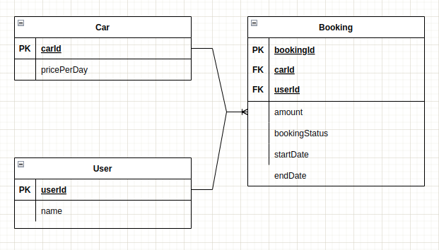

#Car Booking App

##Pre-requisite  
java17 , postgres:11-alpine

##How to run
1) compile  
```mvn clean compile```

2) start postgres  
   if postgres not running then run postgres using docker   
```docker run --rm  --name pg-docker --env POSTGRES_USER="root" --env POSTGRES_PASSWORD="root" -d -p 5432:5432 -v ~/anydir:/var/lib/postgresql/data  postgres:11-alpine```

default username password : root/root   
(if different configure same in src/main/resources/application.yml)

start application from  
```src/main/java/com/app/carbooking/CarBookingApplication.java```

**Refer Postman Collection** for Rest APIs. Import collection in PostMan(v10.6.7)
for playing with application. It has sample API with test data  
```data/car-booking.postman_collection.json```

To add boilerplate data ,can use fakeData in
```data/sample-data.csv```
Copy data to fakeData.csv and use copy-data.sql from psql to inject data. 

##Design
App has 3 entities  
- Car : represents Car which can be booked   
(can be generalized for other vehicles but just kept car to keep things simple)  
- User : User which books the Car  
- Booking : represents booking of particular Car by User  

ER dia:  
Car ---- Bookings (1 to N)  
User ---- Bookings (1 to N)  


Booking has following status:
- BOOKED : inital state when booking is done
- CANCELLED : if booking is cancelled
- ONGOING : once the user picks up the car
- COMPLETED : once the user return the car.  
Checks are added to avoid invalid state transitions.

Car can be booked only when it has no corresponding booking in "BOOKED | ONGOING" state.

Each booking has startDate and endDate and the price is calculated  
 = No of days (endDate - startDate) * price_per_day of Car

To avoid **conflicting bookings** following DB constraint is added to Booking Table
```ALTER TABLE BOOKING
ADD CONSTRAINT  overlapping_booking
EXCLUDE USING gist (
    car_id WITH =,
    DATERANGE(start_date, end_date, '[]') WITH &&
)
where (status = 'BOOKED' or status = 'ONGOING');
```

**Note** :
Assumptions to keep things simple  
- car : properties like petrol/diesel or auto/manual are not added 
- repository and service layer for Car and User is not added
and data will be inserted directly in db using csv 
- late fee is not considered (can be added easily)
- user is allowed to have multiple bookings of different cars at same time.
- booking is done at date level. 
